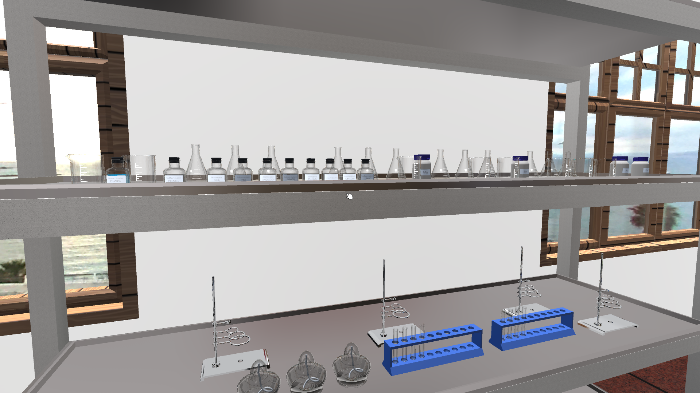
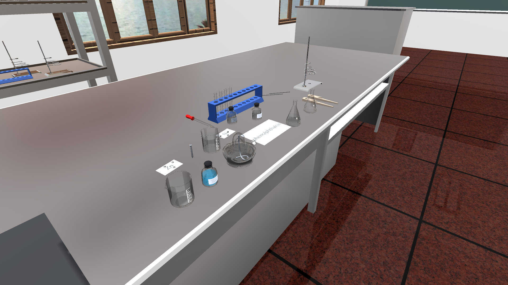
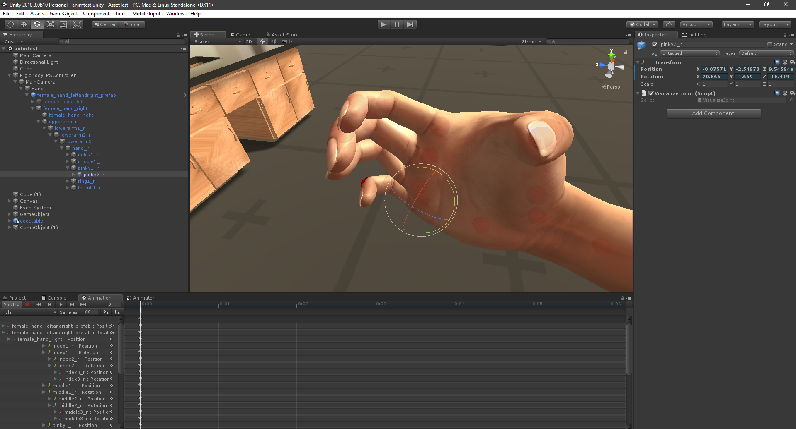

# Virtual-Laboratory
Make with Unity 2018.0.3b10
 
Demo: http://bit.ly/2DtbNkE

  
This is not the source code, it's just cache, source code will be uploaded in the future.
   
# Demo images:
  
<kbd>

  </kbd>

  
<kbd>

  </kbd>
 

  
# I'm making this hand
  
<kbd>

  </kbd>
 
